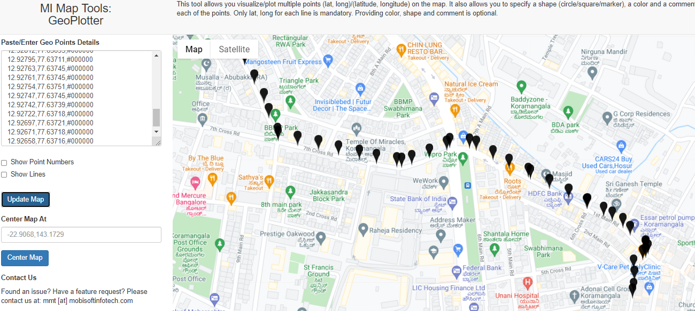
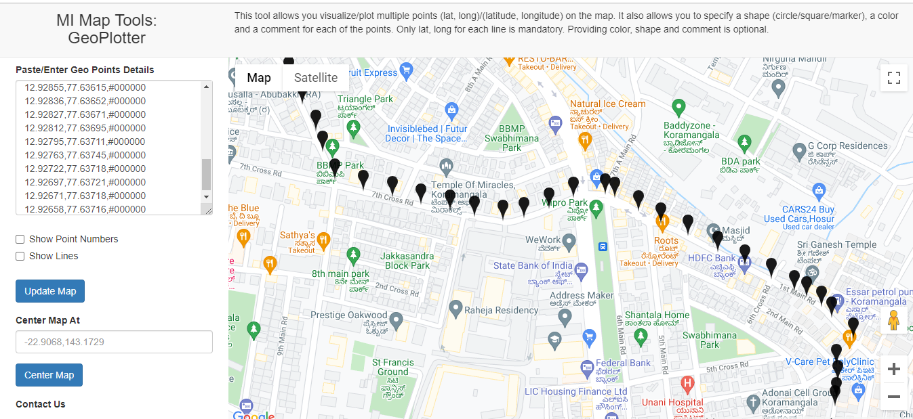

# Locus.sh

Regarding the problem I have called the Google Maps API

> https://maps.googleapis.com/maps/api/directions/json?origin=17.72241886311235,83.31111854603199&destination=17.726095063765282,83.30265317672

From the response I have taken start, end from steps parameter and calculated but failed to correctly point the curved roads.
```
{
                            "distance": {
                                "text": "0.2 km",
                                "value": 201
                            },
                            "duration": {
                                "text": "1 min",
                                "value": 32
                            },
                            "end_location": {
                                "lat": 12.9300056,
                                "lng": 77.6292527
                            },
                            "html_instructions": "Head <b>southeast</b> on <b>8th Main Rd</b> toward <b>7th Cross Rd</b>",
                            "polyline": {
                                "points": "{u|mAgyxxMRGd@SRGf@QXKTG^M^Q`@M^MPENE"
                            },
                            "start_location": {
                                "lat": 12.9316597,
                                "lng": 77.6285175
                            },
                            "travel_mode": "DRIVING"
                        }
```
The overline parameter in routes has an encrypted string

```
"overview_polyline": {
                "points": "{u|mAgyxxMdFiBbBg@bBwLLoBIm@]oA_@kAMM@uAJ]h@kAb@eAl@aB~ByFb@kAPe@\\o@`@_@bAcALKLJHJf@h@p@Er@DXB"
            }
```
So I have used overline points parameter from routes and decoded the encrypted the <b>points</b> string using decode function
> Android Maps Util library

The decoded latitude longitude has covered every point including point of curvature etc.

From there I have calculated the distance using <b>Haversine Formula</b>

###Files and their description
> <b>CommonUtil.java</b> is an Util file which has the calculate distance function and decode overline function <br/>
> <b>MapServiceImpl.java</b> is a service class which takes origin, destination and returns the points which are 50m apart
> <b>MapController.java</b> is an entrypoint controller
```
There exists some points which are the point of curvature etc.
```

Sample API
```
http://localhost:8080/api/v1/coordinates?origin=17.72241886311235,83.31111854603199&destination=17.726095063765282,83.30265317672
```
The Solution For the Problem Statement Mentioned



The coordinates along with the color codes mentioned in application.properties will be present in log or console. We can copy and paste in 
>https://mobisoftinfotech.com/tools/plot-multiple-points-on-map/


