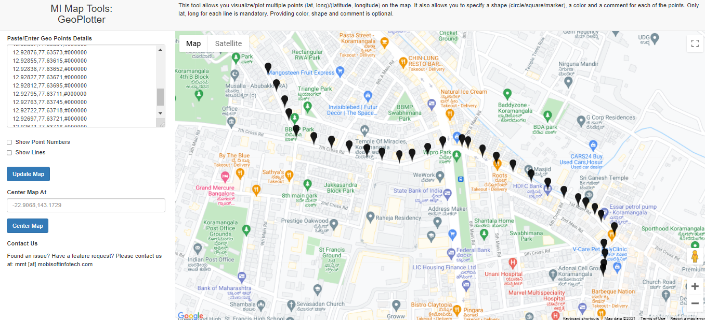
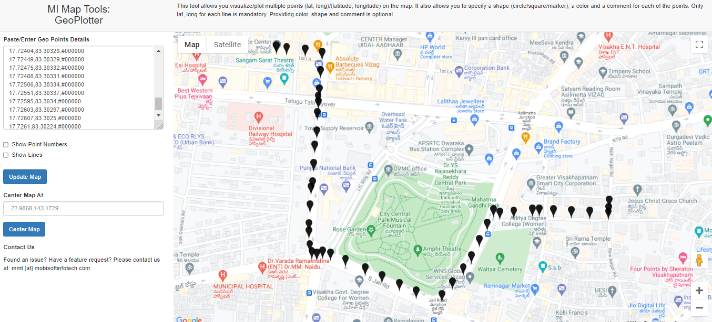

# Locus.sh

Regarding the problem I have called the Google Maps API

> https://maps.googleapis.com/maps/api/directions/json?origin=17.72241886311235,83.31111854603199&destination=17.726095063765282,83.30265317672

From the response I have taken start, end from steps parameter and calculated but failed to correctly point the curved roads.
```
{
                            "distance": {
                                "text": "0.2 km",
                                "value": 201
                            },
                            "duration": {
                                "text": "1 min",
                                "value": 32
                            },
                            "end_location": {
                                "lat": 12.9300056,
                                "lng": 77.6292527
                            },
                            "html_instructions": "Head <b>southeast</b> on <b>8th Main Rd</b> toward <b>7th Cross Rd</b>",
                            "polyline": {
                                "points": "{u|mAgyxxMRGd@SRGf@QXKTG^M^Q`@M^MPENE"
                            },
                            "start_location": {
                                "lat": 12.9316597,
                                "lng": 77.6285175
                            },
                            "travel_mode": "DRIVING"
                        }
```
The overline parameter in routes has an encrypted string

```
"overview_polyline": {
                "points": "{u|mAgyxxMdFiBbBg@bBwLLoBIm@]oA_@kAMM@uAJ]h@kAb@eAl@aB~ByFb@kAPe@\\o@`@_@bAcALKLJHJf@h@p@Er@DXB"
            }
```
inorder to overcome this problem, I have used overline points parameter from routes and decoded the encrypted <b>points</b> string(which is an array of points fater decoding) using decode function
> Android Maps Util library

The decoded latitude longitude has covered every point including point of curvature etc.

I have calculated the distance using <b>Haversine Formula</b>

### Files and their description
> <b>CommonUtil.java</b> is an Util file which has the calculate distance function and decode overline function <br/>
> <b>MapServiceImpl.java</b> is a service class which takes origin, destination and returns the points which are nearly 50m apart<br/>
> <b>MapController.java</b> is an entrypoint controller
```
There exists some extra points which are the point of curvature etc.
```

### Sample API
```
http://localhost:8080/api/v1/coordinates?origin=17.72241886311235,83.31111854603199&destination=17.726095063765282,83.30265317672
```

### Sample API Response
```
[
    {
        "latitude": 12.93166,
        "longitude": 77.62852
    },
    {
        "latitude": 12.93125,
        "longitude": 77.62873
    },
    {
        "latitude": 12.93084,
        "longitude": 77.62894
    },
    {
        "latitude": 12.93051,
        "longitude": 77.62905
    },
    {
        "latitude": 12.93009,
        "longitude": 77.62924
    },
    {
        "latitude": 12.92991,
        "longitude": 77.6297
    },
    {
        "latitude": 12.92981,
        "longitude": 77.63016
    },
    {
        "latitude": 12.9297,
        "longitude": 77.63061
    },
    {
        "latitude": 12.9296,
        "longitude": 77.63107
    },
    {
        "latitude": 12.92951,
        "longitude": 77.63145
    },
    {
        "latitude": 12.92945,
        "longitude": 77.63191
    },
    {
        "latitude": 12.92949,
        "longitude": 77.63224
    },
    {
        "latitude": 12.92964,
        "longitude": 77.63264
    },
    {
        "latitude": 12.9298,
        "longitude": 77.63302
    },
    {
        "latitude": 12.92986,
        "longitude": 77.63352
    },
    {
        "latitude": 12.9298,
        "longitude": 77.63367
    },
    {
        "latitude": 12.92959,
        "longitude": 77.63405
    },
    {
        "latitude": 12.92941,
        "longitude": 77.6344
    },
    {
        "latitude": 12.92922,
        "longitude": 77.63483
    },
    {
        "latitude": 12.92897,
        "longitude": 77.63531
    },
    {
        "latitude": 12.92876,
        "longitude": 77.63573
    },
    {
        "latitude": 12.92855,
        "longitude": 77.63615
    },
    {
        "latitude": 12.92836,
        "longitude": 77.63652
    },
    {
        "latitude": 12.92827,
        "longitude": 77.63671
    },
    {
        "latitude": 12.92812,
        "longitude": 77.63695
    },
    {
        "latitude": 12.92795,
        "longitude": 77.63711
    },
    {
        "latitude": 12.92763,
        "longitude": 77.63745
    },
    {
        "latitude": 12.92722,
        "longitude": 77.63718
    },
    {
        "latitude": 12.92697,
        "longitude": 77.63721
    },
    {
        "latitude": 12.92671,
        "longitude": 77.63718
    },
    {
        "latitude": 12.92658,
        "longitude": 77.63716
    }
]
```
The coordinates along with the color codes mentioned in application.properties will be present in log or console. We can copy and paste in 
>https://mobisoftinfotech.com/tools/plot-multiple-points-on-map/

### The Solution For the Problem Statement Mentioned
<br/>



